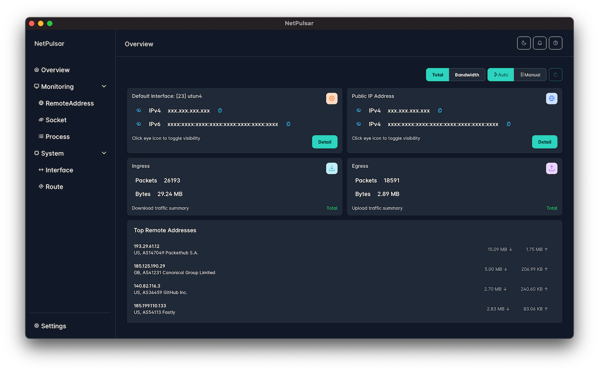

<div align="center">
    <br>
    <h1>NetPulsar</h1>
    <p>
        <strong>Real-time network utilization monitoring tool.</strong>
    </p>
</div>

## Overview
**NetPulsar** is a real-time network utilization monitoring tool. Desktop App.
It provides comprehensive insights into your network's activity, enabling users to monitor traffic, manage connections, and view network configurations with ease.



## Features
- **Real-time Monitoring**: Track network utilization as it happens.
- **Connection Management**: Analyze active connections quickly and effectively.
- **Interface and Routing Insights**: Get detailed views of network interfaces and routing tables.

## Prerequisites
- Ensure you have a compatible operating system (Linux, macOS, Windows).

## Installation

#### Using Installer
Download the installer for your platform from the [releases page](https://github.com/shellrow/netpulsar/releases).

#### Build from source
First, clone the repository:
```
git clone https://github.com/shellrow/netpulsar
```
Then, build the project (assuming Rust and Tauri are already installed):
```
cd netpulsar
cargo tauri build
```
Run the installer in the dist directory.

## Post-Install Configuration

The following post-install configuration steps are applicable to both the CLI version (`netpulsar`) and the desktop application (`netpulsar`).  
These steps ensure that `netpulsar` has the necessary permissions and environment setup to function correctly on different operating systems.

### Post-Install (Linux)

`netpulsar` requires elevated privileges to monitor network packets effectively. On Linux, you can configure these privileges using two main methods:

#### 1. Using `setcap`

Granting capabilities to the `netpulsar` binary allows it to operate with the necessary privileges without requiring `sudo` for each execution.  
This method is recommended for single-user machines or in environments where all users are trusted.

Assign necessary capabilities to the `netpulsar` binary
```sh
sudo setcap 'cap_sys_ptrace,cap_dac_read_search,cap_net_raw,cap_net_admin+ep' $(command -v netpulsar)
```

Run `netpulsar` as an unprivileged user:
```sh
netpulsar
```

#### Capabilities Explained:
- `cap_sys_ptrace,cap_dac_read_search`: Allows `netpulsar` to access `/proc/<pid>/fd/` to identify which open port belongs to which process.
- `cap_net_raw,cap_net_admin`: Enables packet capturing capabilities.

#### 2. Using `sudo` (for multi-user environments)
For environments with multiple users, requiring privilege escalation each time `netpulsar` is run can enhance security.
```
sudo netpulsar
```

### Post-Install (macOS)
On macOS, managing access to the Berkeley Packet Filter (BPF) devices is necessary for `netpulsar` to monitor network traffic:
#### Install `chmod-bpf` to automatically manage permissions for BPF devices:

Install prebuilt binaries via shell script
```
curl --proto '=https' --tlsv1.2 -LsSf https://github.com/shellrow/chmod-bpf/releases/latest/download/chmod-bpf-installer.sh | sh
```

Install prebuilt binaries via Homebrew
```sh
brew install shellrow/tap-chmod-bpf/chmod-bpf
```

#### Check BPF device permissions
```
chmod-bpf check
```

#### Install the chmod-bpf daemon to automatically manage BPF device permissions
```
sudo chmod-bpf install
```

#### macOS Security
After installing netpulsar Desktop on macOS, you may encounter a security warning that prevents the app from opening, stating that it is from an unidentified developer. This is a common macOS security measure for apps downloaded outside of the App Store.

To resolve this issue and open netpulsar Desktop, you can remove the security attributes that macOS assigns to the application using the following command in the Terminal:

```sh
xattr -rc "/Applications/NetPulsar.app"
```

### Post-Install (Windows)
- Ensure that you have [Npcap](https://npcap.com/#download) installed, which is necessary for packet capturing on Windows
- Download and install Npcap from [Npcap](https://npcap.com/#download). Choose the "Install Npcap in WinPcap API-compatible Mode" during installation.

### License
`netpulsar` is released under the MIT License. See the LICENSE file for more details.
